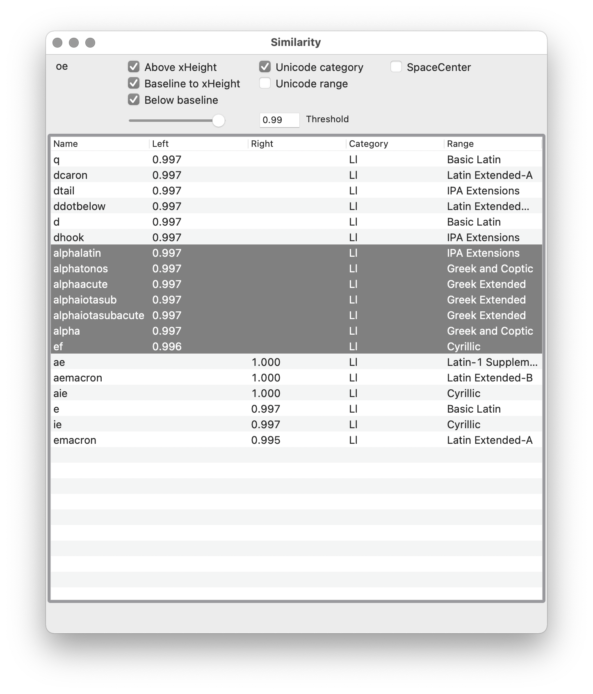

# LTR Similarity

This is an experimental approach to calculating a value that represents the similarity between the sides of different glyphs. RoboFont4 extension. 

Dedicated to my GitHub Sponsors! Your support makes research like this possible, thank you!