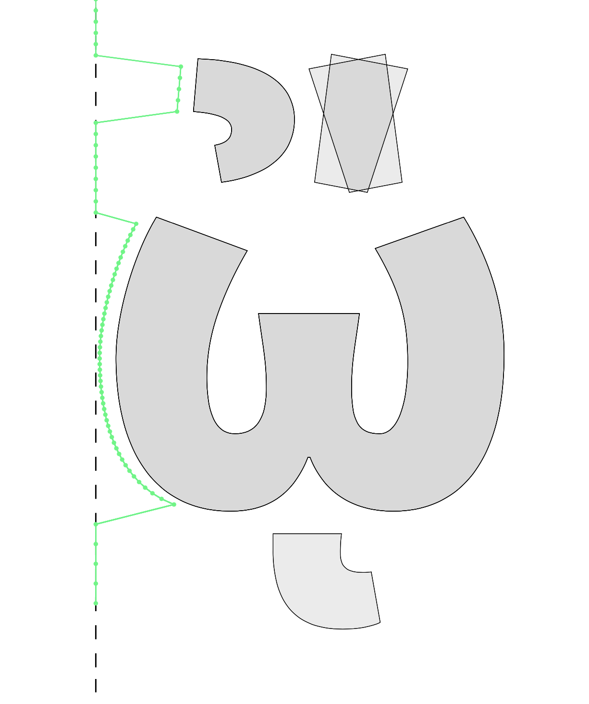

# Similarity

This is an experimental approach to calculating a value that represents the similarity between the left sides or right profiles of different glyphs.

This shows in green the profile of four different glyphs (omegaiotasublenisacute, omegaiotasublenisgrave, omegalenisacute and omegalenisgrave in Source Sans Black)

## How

Using [cosine similarity [wikipedia]](https://en.wikipedia.org/wiki/Cosine_similarity) we can calculate a value that represents how similar the two profiles are, with 1.00 is the highest and best score. Less similar profiles will score lower, sometimes even below 0. For this experiment only values very close to 1 make sense.
